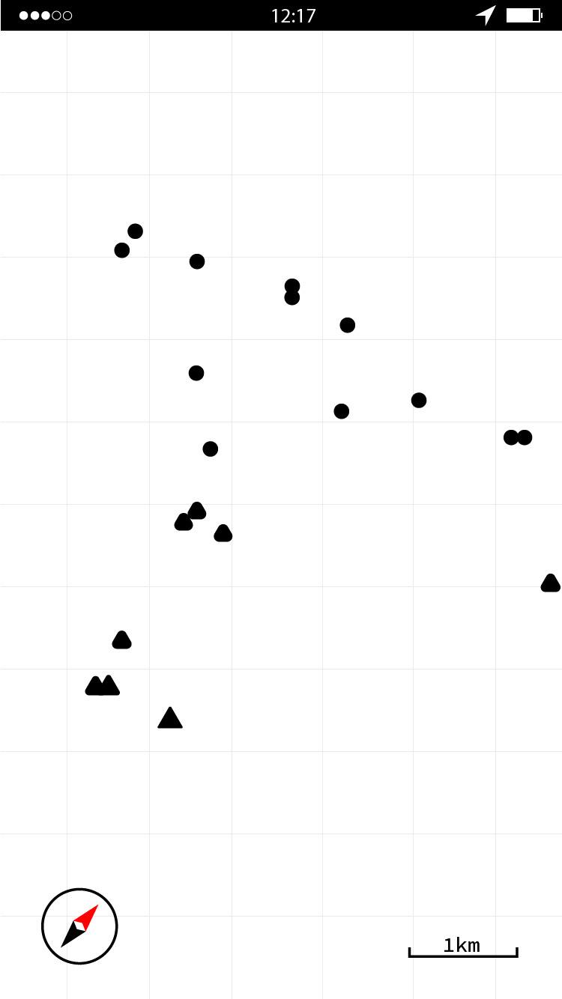
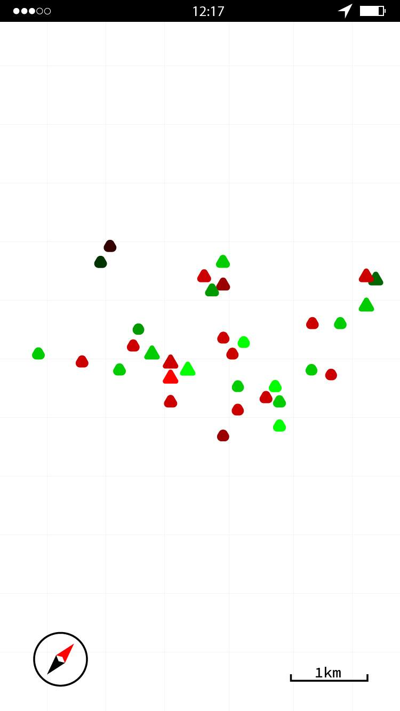
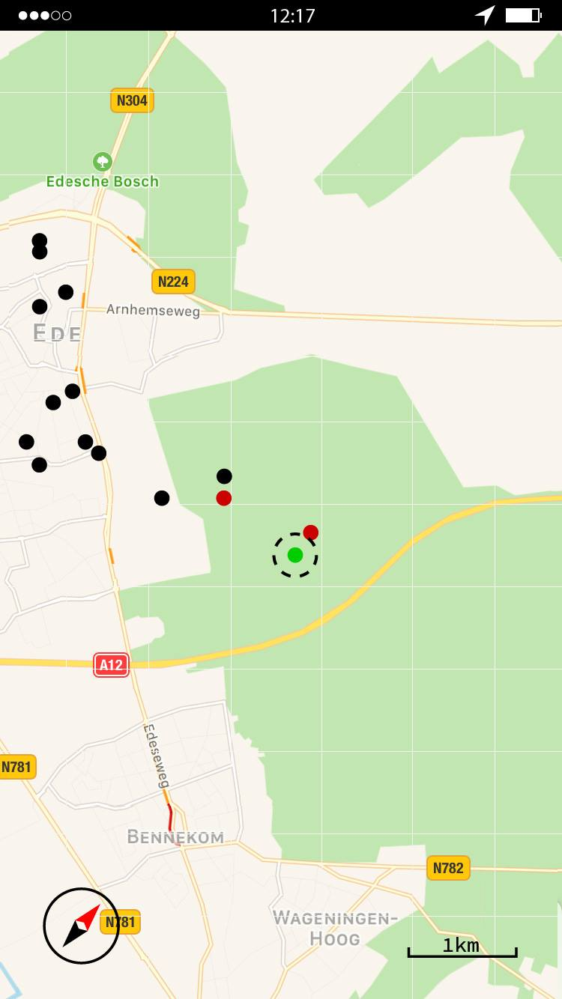
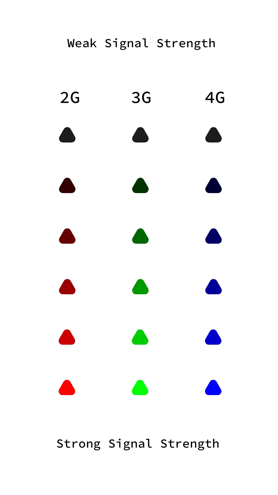
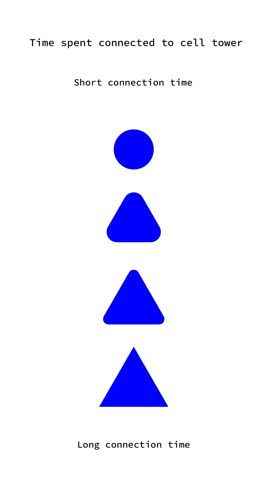

# Tower Tracker

### What?
The Tower Tracker is a tool that you can install on your phone. You will get an overview of the cell towers you have connected to, their location, the strength of the connection and the duration of the connection.
Through the day you took and used your phone from place to place. The phone connects to the network through cell towers, working on different frequencies and technologies like 2G, 3G and 4G. To have a good connection there are hundreds of cell towers throughout the country that enables your phone have a good network. Every cell tower has its own providers that it connects with. If you change location you will connect to a new tower as each tower only has a certain reach.

### About the app
In the app we want to visualize the data that the phone gets from these cell towers. The information you get is the location of the Cell tower (made from GSM Cell ID, GSM Location Area Code (LAC), Mobile Country Code (MCC), Mobile Network code (MNC)), Signal strength and how long you have been connected to the tower .
With this app you have a broad view of all the cell towers you've been connected to.

### How to install - Dependencies
You have to have an android phone and then can install this app in the PlayStore. The app will then log your connections and visualize it

### Video
[Click Here for the Tower Tracker video](https://www.youtube.com/watch?v=tPix0b-Rklw&feature=youtu.be)

### Examples & screenshots

  

  

  

  

  

### Possible coding solution
To scrape this data and find it there would be a good solution to create an app for that
The android operating system already has functions to get all the info needed in their library.
The function of the app would be to get the main parameters that we need to scrape to visualize them. Those are 1. Cell tower location, 2. Signal strength, 3. Connection time.
However as the class is mainly about python and Android apps are mainly written in Java we couldn’t put this to the test.

The Cell tower location. https://developer.android.com/reference/android/telephony/CellIdentityGsm.html
The phone only know which tower it is connected to and its ID but it never knows where exactly that tower is located. To find this out we need to first find the identity of the tower.
Android Dev system already has a CellIdentityGsm class with functions to get everything we need.
These functions should get us all the parameters
int	getCid()
int	getLac()
int	getMcc()
int	getMnc()
From there we can cross-reference these ID’s with open source cell tower locations like https://opencellid.org/
From there we know which tower we are connected to and where it is.

Signal Strength. https://developer.android.com/reference/android/telephony/CellSignalStrength.html
Now we need to know the strength of the connection we have with each tower. For that we would use the CellSignalStrength class and inside there use the function
getDbm( )
This returns a value from -120 to -50 which is the strength of the connection to the tower, with -120 being no connection and -50 being perfect connection. From there we can visualize the cell tower with -120 being black and -50 being full 255 R, G or B depending on the type of tower (2G is red, 3G is green and 4G is blue.

Connection time
This can be sorted by logging the above info every second and counting how many times you’ve been connected to each tower. This can then be visualized with letting the tower start as a dot and then slowly morph into a triangle as the connection stays longer.
