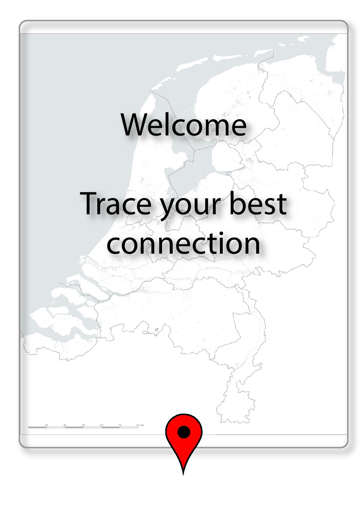

# Tower Tracker

### What?
The Tower Tracker is a tool that you can install on your phone. You will get an overview of the cell towers you've used, where you've been contected to and ...
Through the day you took and used your phone from place to place. Most people have a mobile network on their phone which is 3g or 4g. To have a good connection there are hundreds of cell towers through the country that makes your phone having a good network. Every cell tower has its own providors that it connects with. If you are subscribed at for instance KPN your phone will only track the towers from KPN. You will never be connected to the same tower all the time because of the distance. If you get further away from one tower you will automaticly connect to another one closer by. 

### About the app
In the app we want to visualize the data that the phone gets from these cell towers. The information you get is the frequency of the connection, GSM Cell ID, GSM Location Area Code (LAC), Mobile Country Code (MCC), Mobile Network code (MAC), Operator and how many times you've be connected.
With this app you have a broad view of all the cell towers you've been connected to.

### How to install - Dependencies
You have to have an android phone and then can install this app in the playstore. Immediately  the app will know which provider you use and what your location is. 

### Examples & screenshots

  

### Licence MIT
Copyright 2017 Einar Andersen, Marleen Vos, Benjamin McMillen, Merel IJpelaar

Permission is hereby granted, free of charge, to any person obtaining a copy of this software and associated documentation files (the "Software"), to deal in the Software without restriction, including without limitation the rights to use, copy, modify, merge, publish, distribute, sublicense, and/or sell copies of the Software, and to permit persons to whom the Software is furnished to do so, subject to the following conditions:

The above copyright notice and this permission notice shall be included in all copies or substantial portions of the Software.

THE SOFTWARE IS PROVIDED "AS IS", WITHOUT WARRANTY OF ANY KIND, EXPRESS OR IMPLIED, INCLUDING BUT NOT LIMITED TO THE WARRANTIES OF MERCHANTABILITY, FITNESS FOR A PARTICULAR PURPOSE AND NONINFRINGEMENT. IN NO EVENT SHALL THE AUTHORS OR COPYRIGHT HOLDERS BE LIABLE FOR ANY CLAIM, DAMAGES OR OTHER LIABILITY, WHETHER IN AN ACTION OF CONTRACT, TORT OR OTHERWISE, ARISING FROM, OUT OF OR IN CONNECTION WITH THE SOFTWARE OR THE USE OR OTHER DEALINGS IN THE SOFTWARE.
