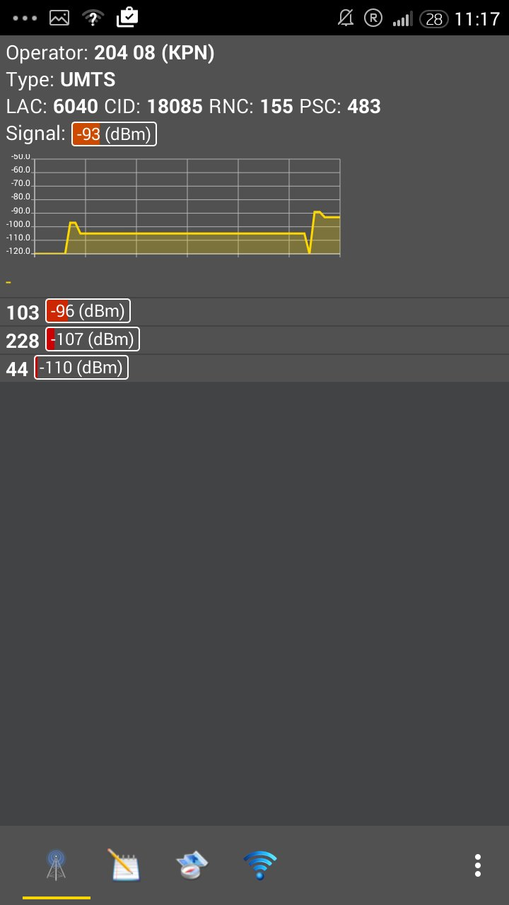

# Reasearch
Here you can find our references.

### Website links
* https://www.reddit.com/r/AndroidQuestions/comments/2wowdg/how_to_scrape_data_from_android_apps/
* https://opencellid.org/#action=heatMaps.dailyHeatmap
* http://stackoverflow.com/questions/4152373/how-to-know-location-area-code-and-cell-id-in-android-phone
* http://stackoverflow.com/questions/17803431/how-to-get-correct-cell-id-and-location-area-code-in-android
* https://developer.android.com/reference/android/telephony/CellSignalStrength.html 
* https://developer.android.com/reference/android/telephony/gsm/GsmCellLocation.html
* https://mitmproxy.org

### Screenshots 
These are the screenshots we've used of the app 'Netmonitor' and 'CellID Info'. In these apps you are able to see the surrounding celltowers, the towers you've been connected to and the information/statistic about the cell towers.

  

  

  

  

  

  

